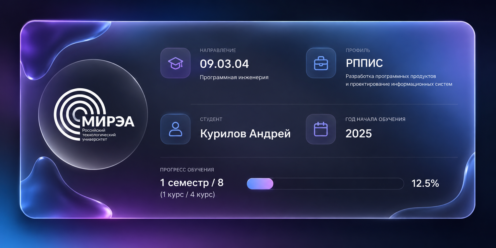

# 🎓 RTU MIREA

 

---

## 📂 Структура репозитория

- [1 курс](1%20курс)
  - [1 семестр](1%20курс/1%20семестр)
    - [Информатика](1%20курс/1%20семестр/Информатика)
  - [2 семестр](1%20курс/2%20семестр)
    - [Информатика](1%20курс/2%20семестр/Информатика)
    - [Объектно-ориентированное программирование](1%20курс/2%20семестр/ООП)
      - [Упражнения](1%20курс/2%20семестр/ООП/Упражнения) (4 блока по 3 задачи)
      - [Курсовые версии 1-4](1%20курс/2%20семестр/ООП/Курсовые) (сдано Путуридзе З. Ш.)
    - Ознакомительная практика (проект [AllTrack](https://github.com/PartyCorn/AllTrack))
    - [Структуры и алгоритмы обработки данных](1%20курс/2%20семестр/СиАОД) (1.1 - 3.2)
    - [Системы искуственного интеллекта и большие данные](1%20курс/2%20семестр/СИИиБД) (6 рабочих тетрадей)

## ⚡ Технологии

  

## ⭐ Поддержка

Если репозиторий оказался полезен:

* поставь ⭐
* сохрани себе
* используй для подготовки

## РТУ МИРЭА • 2026 • Курилов Андрей

